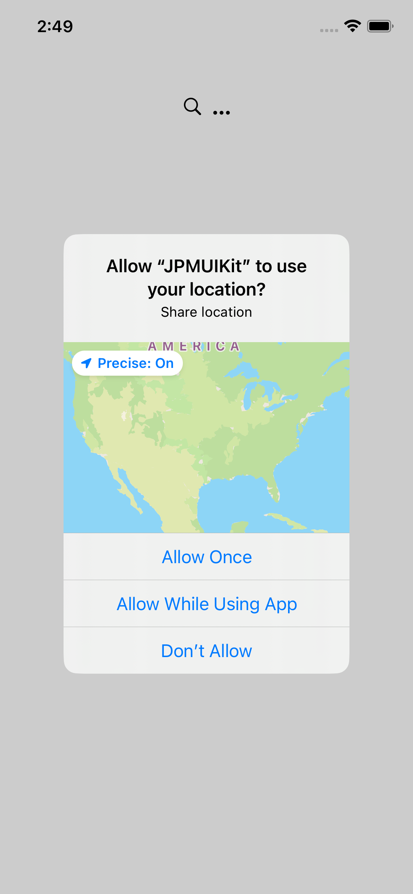
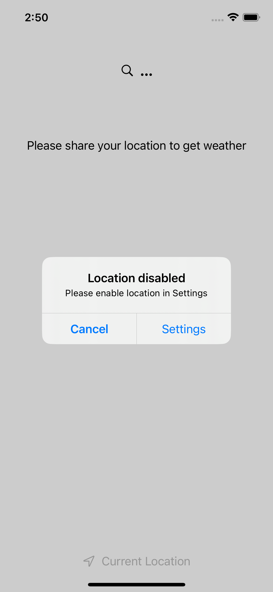
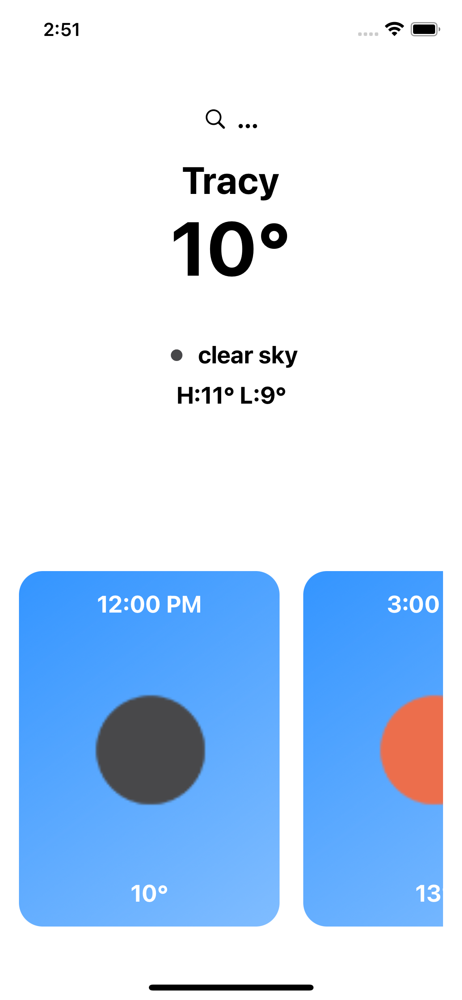
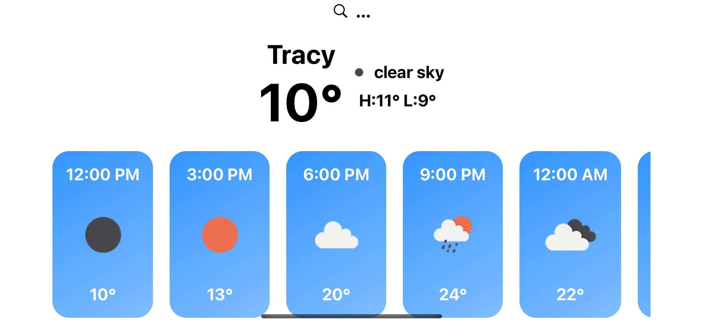
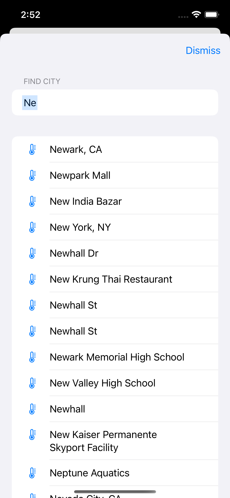

### Screenshots

|  |  |  |
| - | - | - |
|  |  |    |
|  |  |    |

The project is designed to support iOS 14 and serves as a UIKit skeleton project. However, the majority of its implementation, approximately 90%, is built using SwiftUI. I have also worked with UIKit for six years, but I believe that declarative programming, such as SwiftUI, offers Simplicity and Readability.

### Implemented Requirements

The following requirements have been implemented:

- **Save/Load City**: The project supports saving and loading city data.
- **Location Permission Handling**: The app handles location permission requests and interactions.
- **Background Location Toggle**: The app handles toggling location updates while it is running in the background.
- **Image Cache with URLCache**: Image caching is implemented using `URLCache` for improved performance.
- **UI Support for Portrait and Landscape**: The user interface adapts and supports both portrait and landscape orientations.
- **Preview Support in Xcode**: All views in the project are designed to support previewing in Xcode.

### Additional Features

In addition to the implemented requirements, the project includes some noteworthy features:

- **Generic Endpoint Response Handling**: The project leverages 1Swift `Generics` to handle fetching different response types from endpoints, allowing for flexibility and reusability.
- **Async/Await for Concurrent and Asynchronous Tasks**: `Async/await` functionality is utilized to manage concurrent and asynchronous tasks effectively.
- **Using Combine to Buffer User's Search Typing for Sending  query request**: Utilizing Combine's `debounce` operator to delay query requests based on the user's search typing.

### Potential Improvements (With More Time)

Given more time, the following improvements and additions would be made to the project:

- **Additional Testing and Error Handling**: Enhanced testing and error handling would be implemented to ensure robustness and reliability.
- **Unit Testing**: Unit tests would be developed to validate the behavior and functionality of the codebase.
- **Improved Preview Mocks**: Enhancements to preview mocks would be made to provide more accurate representations of the app's appearance and behavior.

